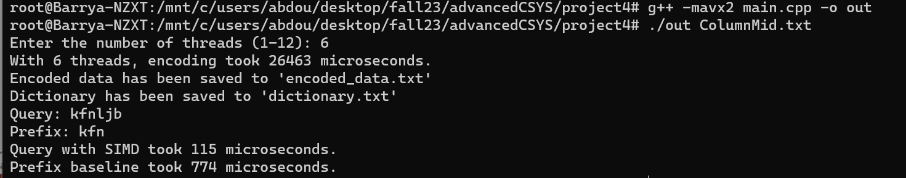
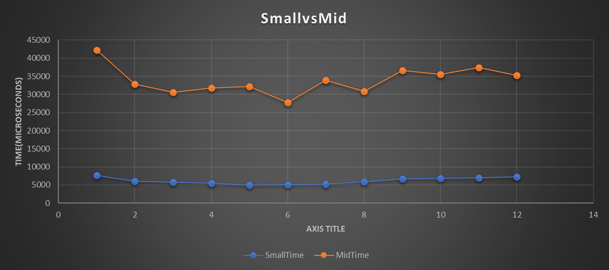
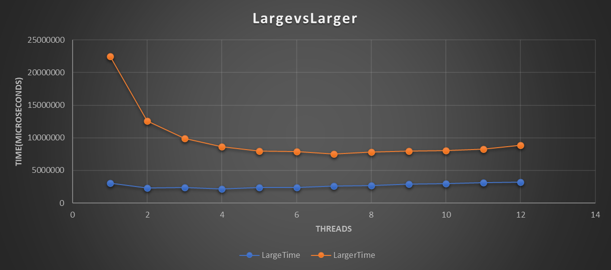
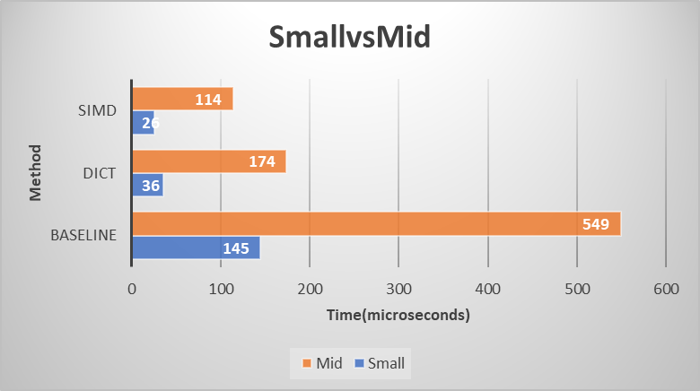
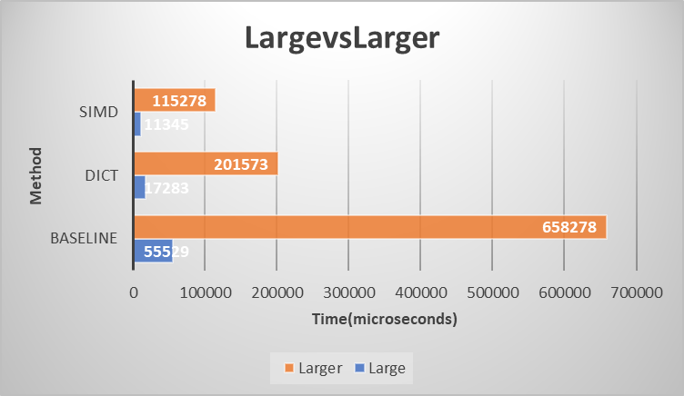
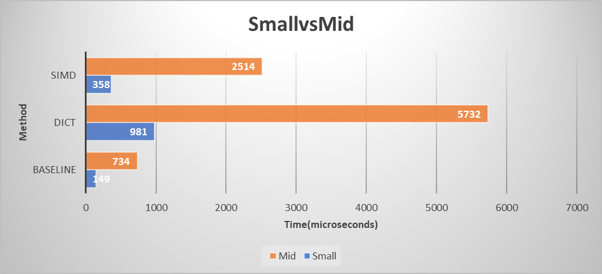
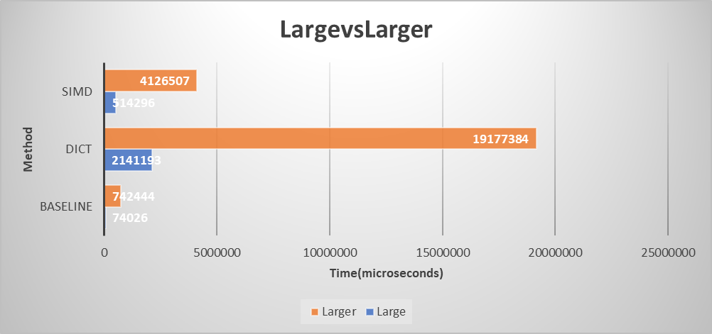

## Implementation of Dictionary Codec
The objective of this project is to implement a dictionary codec. Dictionary encoding is being widely used in real-world data analytics systems to compress data with relatively low cardinality and speed up search/scan operations. In essence, a dictionary encoder scans the to-be-compressed data to build the dictionary that consists of all the unique data items and replaces each data item with its dictionary ID. To accelerate dictionary look-up, I used a hash-table to better manage the dictionary. In addition to reducing the data footprint, dictionary encoding makes it possible to apply SIMD instructions to significantly speed up the search/scan operations.

My implementation supports the following operations:

(1) 
Encoding: given a file consisting of raw column data, program carries out dictionary encoding and generates an encoded column file and a dictionary file. To improve time efficiency, the program utilizes a multi-threaded implementation of dictionary encoding. For the encoded data column, I use integer compression to further reduce the footprint of the encoded data column on the SSD with the FastPFor library that can be found here: https://github.com/lemire/FastPFor

(2)
Query: Currently, the query is just a random string that I generate. Making this into something the user inputs is fairly trivial and I will update in the future. 

(i) Upon receiving a query, my code checks whether the item exists, if it exists, returns the indices of all the matching entries in the column.

(ii) Given a prefix, searches and returns all the unique matching data items and their indices. My implementation further supports the use of SIMD instructions to speed up the search/scan.

(3)
Finally, the code retains the vanilla column search/scan (i.e., without using dictionary encoding), which is used as a baseline for the speed performance comparison.

---

### Usage

To keep things simple, there is only one program that integrates all of the desired functionality described above. Among the numerous libraries utilized, the only one that has a visible effect during compilation is the "immintrin.h" library, provided by Intel for C and C++, which allows the use of Advanced Vector Extensions 2 (AVX2) intrinsics for SIMD based programming.

Using GCC, program can be compiled with:

```
g++ -mavx2 main.cpp -o exe
```

The "-mavx2" dialogue lets the compiler know to generate code that leverages AVX2 instructions and is critical for enabling and optimizing the use of AVX2 instructions. Neglecting the flag may lead to errors in program execution.

If you encounter the error 'undefined reference to 'pthread_create', simply add the '-pthread' flag in compilation.

Example:

```
g++ -mavx2 -o exe main.cpp -pthread
```

After compiling, the program requires only one input which is a column file of strings.

```
./exec columnfile.txt
```

NOTE:

When running the program currently, there are some small things to consider:

(1) You might want to comment out the final print statements at the bottom of main when the program is running very large column files, as the prints from the related vectors would be numerous and unhelpful.

(2) For the Prefix Search and Query Search functions, in order to change the methods from the vanilla baseline to dictionary without using SIMD to dictionary with SIMD, simply comment and uncomment the method to test and the time measurements will output accordingly. Future update will be to automate this functionality and have the program run all of the test configurations without user changes.

---
#### Proof of Concept/Functionality

Example Output:

<p align="center">  </p>

As you can see, when running some column file, the code will request a valid number of threads, perform the encoding and print the duration in microseconds. After having written the encoded data into the respective files, the random query is printed and the prefix is based on that query currently. This can also be changed in the future. Finally, the program outputs the Query and Prefix method used and the duration for each.

---

### Experimental Results and Analysis

Column Files used for testing:

(i) ColumnSmall - Size 90 KB appx.

(ii) ColumnMid - Size 500 KB appx.

(iii) ColumnLarge - Size 50 MB appx.

(iv) ColumnLarger - Size 500 MB appx.

Unfortunately, I was unable to run tests on any files larger than this as my program would get killed by the compiler for using too much memory every time. However, I think this data is still very relevant and truthful to the performance differences when using dictionary encoding.

#### (1) Encoding Speed under Variable Threads

(i)
<p align="center">  </p>

This graph shows a comparison between the encoding time for ColumnSmall and ColumnMid in microseconds over a thread number from 1 to 12. Naturally, the encoding time for a larger text file is longer. Interestingly, it is very easy to see there's a point where increasing the number of threads becomes detrimental to the encoding performance as too many threads for some 'x' amount of data will introduce overhead that will overshadow the benefits of concurrent operations. For ColumnSmall, the optimal number of threads seems to be around 5 or 6 and for ColumnLarge it is undoubtedly 6 threads. While this is notable, it's also important to understand this behavior will vary with different implementations of multi-threading.

(ii)
<p align="center">  </p>

This is a graph of the 2 larger column files, ColumnLarge & ColumnLarger. While there aren't many differences between the encoding speeds for the ColumnLarge file, there is an observed drop in encoding time of the ColumnLarger data from around 22 seconds to 12 seconds with a thread count increase from 1 to 2. From that point forward, there is a steady decrease in encoding time as the thread count increases up until thread # 12 where there is a slight jump. I appreciate this behavior especially as it resembles the inverted exponential function $e^{-x}$.

#### (2) Query Search Speed Performance

(i)
<p align="center">  </p>

Bar graph comparing the single item search performance on 2 encoded column files from ColumnSmall and ColumnMid respectively. The behavior is the same for both files. The baseline method of searching is very undesirable and costly whereas utilizing dictionary encoding, the time can be cut down drastically and furthermore with the inclusion of SIMD instructions. 

(ii)
<p align="center">  </p>

For larger column files, the time for searching is much greater. Regardless, the behavior seen in the experiments is still very much the same as compared to the smaller column files. You will notice SIMD instructions combined with dictionary encoding is the fastest method to search for an item. Again, the baseline method is very costly, especially for the 500 MB file, ColumnLarger.

#### (3) Prefix Search Speed Performance

(i)
<p align="center">  </p>

In examining the prefix search speed of the encoded column files, I noticed some curious and unexpected behaviors. Initially, as I thought, the addition of SIMD instructions made the prefix search faster but only when compared to dictionary search alone. In this experiment the baseline search seems to be the preferred method at least in terms of my program operation. The performance difference between the dictionary search and baseline search is too drastic to ignore. This may indicate a problem with my code or just a quirk of my implementation.

(ii)
<p align="center">  </p>

Again, there is the similar pattern of SIMD instructions being faster than dictionary search alone, but the baseline outpacing both. This revealed to me that my method of prefix searching may be flawed. However, intuitively this makes sense to me as in the baseline prefix search, while the program is parsing through a lot of raw data, it is doing so directly and not going through the trouble of looking for specific keys and then finally looking through the encoded column file. I would not be surprised though if this behavior was not present in much larger files where iterating through a raw data vector is undesirable.

---

### Conclusion

By utilizing dictionary encoding and SIMD instructions, the performance of a program that must continuously access data can be greatly increased.

This project made the improvements of dictionary encoding readily observable and revealed a lot about why it's popular in industry currently and will likely continue to be. In many ways, the world is governed by the movement and organization of data so understanding how to best manipulate it and access it is a paramount skill to have as a programmer. 
